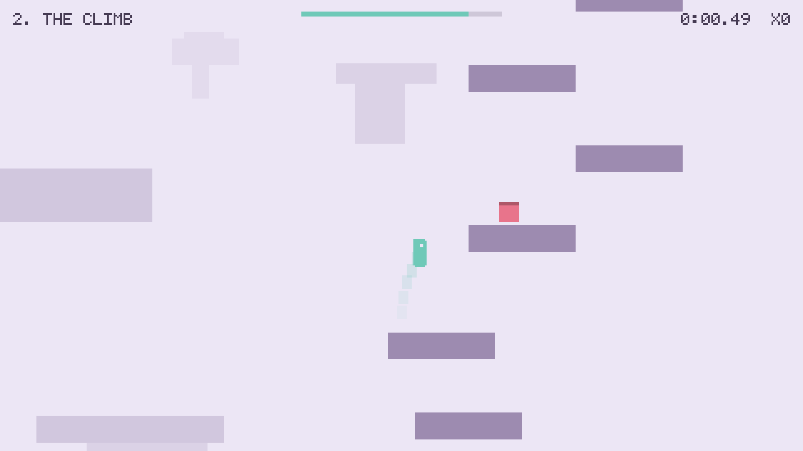
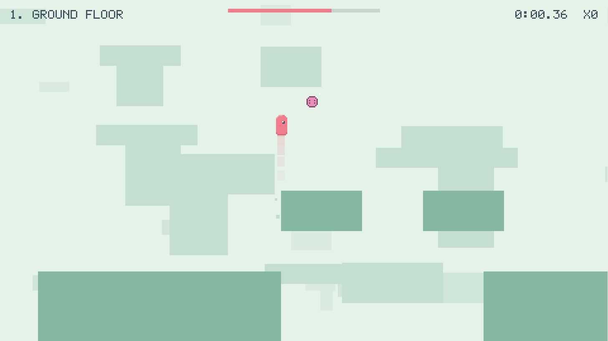
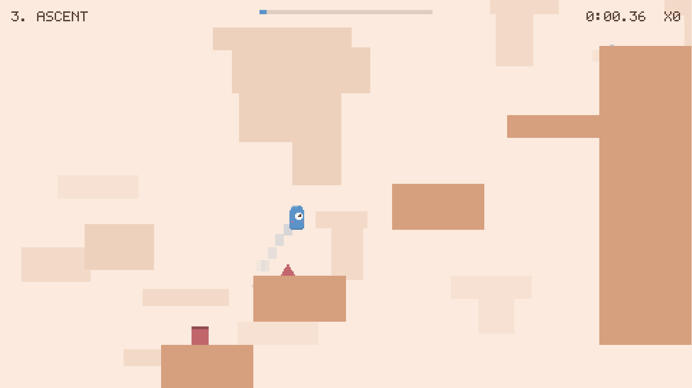
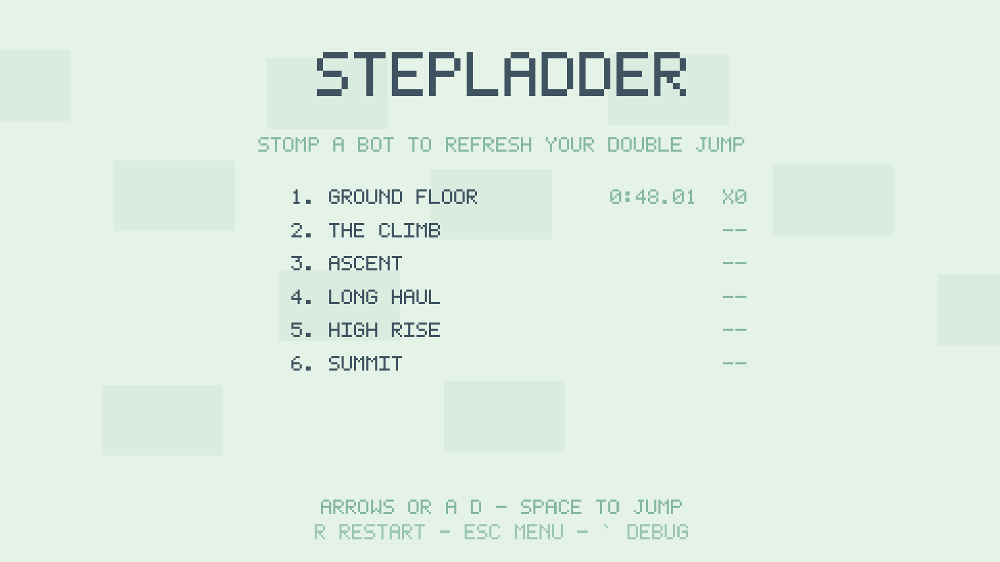

# Foothold

> The things trying to kill you are also the only way up.



A pastel 2D procedurally-generated side-scroller. Six levels across three
orientations — run right, climb up, and ascend diagonally — all driven by one
system.

**The core mechanic:** stomping a bot kills it, bounces you, *and refreshes your
double jump*. Bots aren't obstacles, they're terrain. Some ledges are only
reachable by stomping your way up to them.

See [DESIGN.md](DESIGN.md) for the design, and [INFO.md](INFO.md) for working
notes — invariants, environment traps, how to verify changes, and what is open.

## Screenshots

| Ground Floor — the horizontal opener | Ascent — diagonal, with spikes |
| :--- | :--- |
|  |  |
| **Level select** | **The palette shifts every level** |
|  | Mint, lavender, peach, sky, rose, slate — four colours each. |

---

## Run it

One script installs what's missing, starts the server, and opens the game.

| | |
|---|---|
| Windows | double-click **`start.bat`**, or `.\start.ps1` |
| macOS / Linux | `./start.sh` |

**Ctrl-C stops the server.** Vite runs in the foreground, so the interrupt
reaches it directly and nothing is left holding the port.

Defaults to port 5199. Pass another if it's taken:

```bash
./start.sh 5200            # or:  start.bat 5200
.\start.ps1 -Port 5200
```

Set `NO_OPEN=1` (or `-NoOpen`) to start the server without launching a browser.

> On Windows, Ctrl-C makes cmd.exe ask *"Terminate batch job (Y/N)?"*. That's
> just cmd tidying up — the server is already stopped by the time you see it.

Or do it by hand:

```bash
npm install
npm run dev
```

> The default Vite port is 5173. If that's already serving a different app, an
> old service worker from another project may be intercepting it — use another
> port.

## Controls

| | Keyboard | Touch |
|---|---|---|
| Move | `←` `→` or `A` `D` | left / right pads, bottom-left |
| Jump / double jump | `Space`, `W`, or `↑` | button, bottom-right |
| Restart level | `R` | — |
| Back to menu | `Esc` | — |
| Mute | `M` | — |
| Debug overlay | `` ` `` | — |

Hold jump longer to jump higher. The double jump refreshes every time you stomp
a bot.

## Build and share

```bash
npm run build          # -> dist/         static site, host anywhere
npm run build:single   # -> dist-single/foothold.html  ONE self-contained file
```

**`dist-single/foothold.html` is the shareable artifact.** Everything — engine,
game, levels, font, sounds — is inlined into a single ~1.3 MB HTML file. Email
it, drop it in Slack, or put it on a USB stick; whoever gets it just
double-clicks. No server, no install, no build step, and it works offline.

> It is built as a **classic script, not an ES module**, on purpose. Browsers
> refuse to execute `<script type="module">` from a `file://` URL — it counts
> as a cross-origin fetch — so a module build shows a blank page to anyone who
> double-clicks it. `vite.config.ts` emits an IIFE and strips the module
> attributes for this reason.

`dist/` is a normal static site for GitHub Pages, Netlify, or any static host.
Asset paths are relative, so it works from a subdirectory too.

## Project layout

```
src/
  tuning.ts     Every number that defines how the game feels. Generator limits
                are DERIVED from these, so retuning the jump retunes the levels.
  rng.ts        Seeded RNG (mulberry32). Math.random() appears nowhere else.
  chunks.ts     The ASCII chunk library + validators.
  world.ts      Chunk stitching, tile grid, greedy rect merging.
  player.ts     The controller: coyote time, jump buffer, jump cut, corner correction.
  entities.ts   Turret / walker / flyer bots and projectiles.
  levels.ts     Level definitions and progress persistence.
  palette.ts    Four pastel colours per level.
  font.ts       Built-in 5x7 bitmap font, generated to a texture at boot.
  audio.ts      Web Audio sound, synthesised at runtime. No audio files.
  music.ts      Chirpy music-box score: a theme for the title and each level.
  assist.ts     Local difficulty help at repeated failure points.
  input.ts      Keyboard + touch, one surface.
  tufflings.ts   The Tufflings: every playable character, its faces, and the pick.
  scenes/       Menu, Tufflings (character select) and Game.
```

## Authoring a level chunk

Chunks are 24x16 ASCII grids in `src/chunks.ts`. Add one to the right family
array and it enters the generator's rotation immediately.

```
.  empty     #  solid     ^  spike
E  entry     X  exit
T  turret    W  walker    F  flyer
```

Seam conventions, by family:

| Family | Entry | Exit | Next chunk goes |
|---|---|---|---|
| `h` horizontal | col 0 | col 23 | right, aligned to the exit row |
| `v` vertical | row 15 | row 0 | above, aligned to the exit column |
| `d` diagonal | (1,14) | (22,1) | up and right, fixed step |

`validateChunks()` runs at startup and logs to the console. It checks
dimensions, seam markers, entry headroom, and — for vertical chunks — whether
every rung of the climb is actually reachable given the current jump physics.
Flyers count as rungs in `botGated` chunks.

**Rule for `botGated` chunks:** a bot that is the only route past a section must
have a pit beneath it. Kill the bot, miss the landing, and you need to die and
retry — not be stranded in a level you can no longer finish.

## Determinism

Levels regenerate identically from a seed, because death restarts the level and
a level you can't learn isn't fair. That means:

- seeded RNG only, never `Math.random()`
- fixed 60 Hz timestep; no physics code reads real frame delta
- bot timers seeded from the level seed

A useful side effect: any bug reproduces from its seed.

## Status

MVP. Playable end to end. Art is programmatic shapes rather than pixel-art
sprites. Sound is death, double jump, head bonk, and a chirpy music-box score.
See the milestone table in DESIGN.md.
