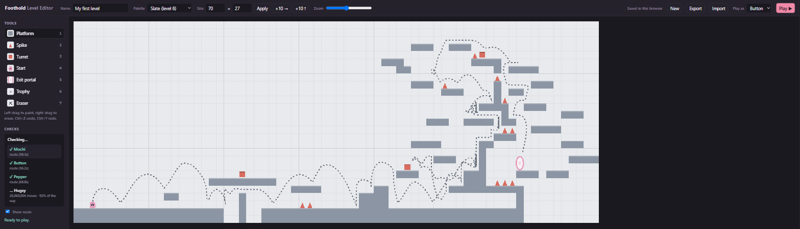

# Custom levels

Hand-built levels from the level editor (`/editor.html`), **playable but not
shipped**. Nothing in this folder is loaded by the game or included in a build.

Run `npm run dev` and open **http://localhost:5199/editor.html**. The dotted
line is the editor's own check: it plays the level with the game's physics,
once for each Tuffling, and draws the route it found to the portal.

To add one: in the editor, press **Export** and save the `.json` file here.

To play one: in the editor, press **Import**, pick the file, then **Play ▶**.

When a level is ready to ship, it moves out of here into the game proper.
